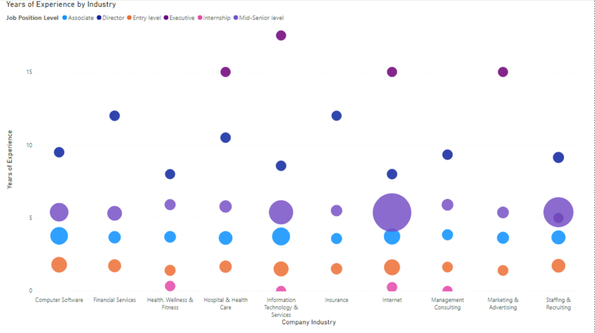
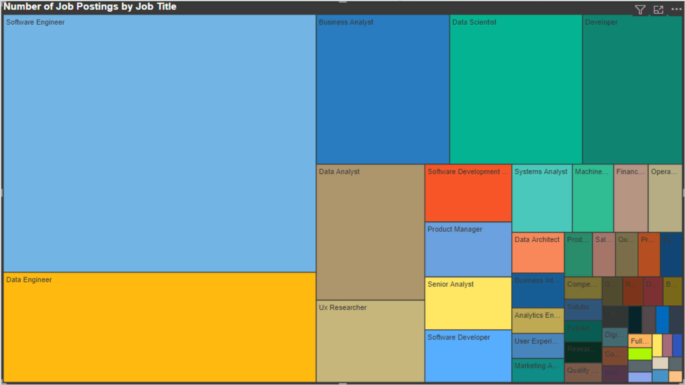
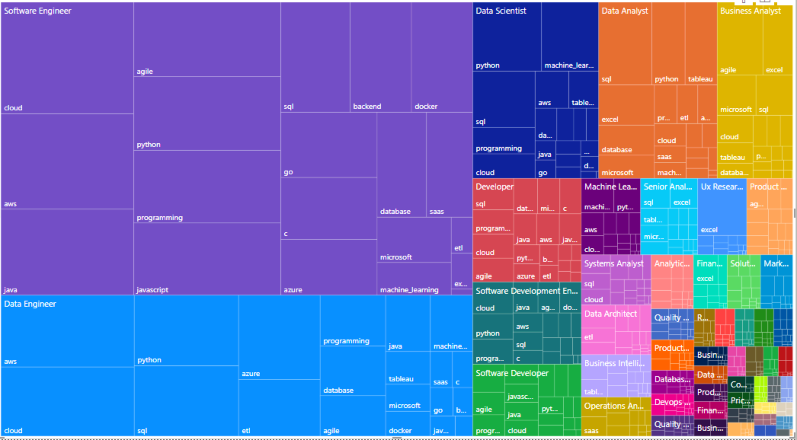
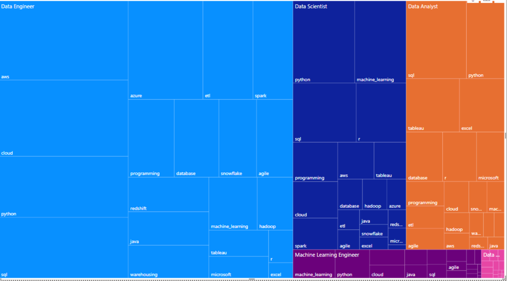
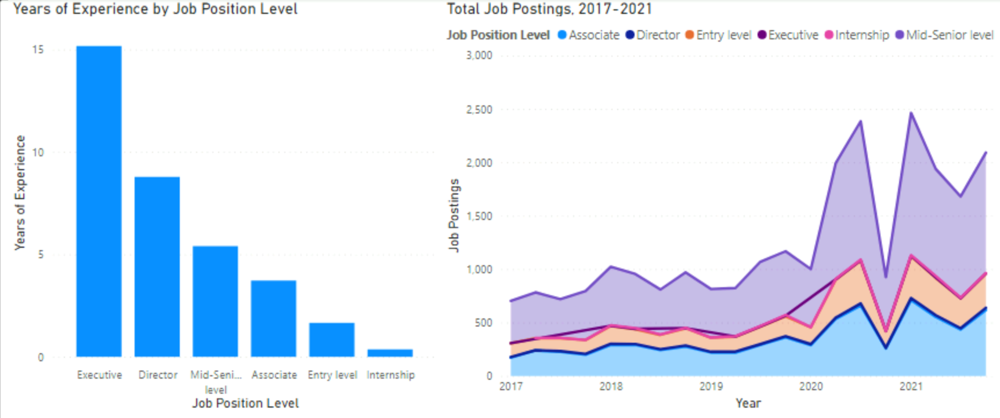
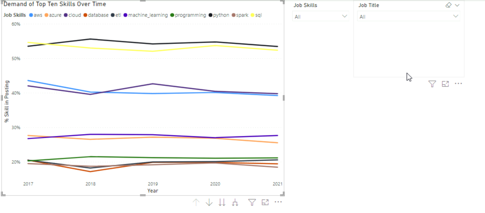
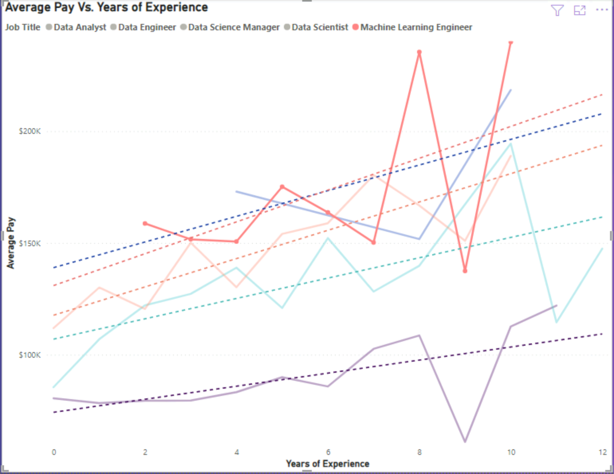

# Data-Science-Jobs-Analysis
Used Power BI to visualize and interpret fictional job data as part of DataCamp course 

## Overview

Using Power BI, data from fictional data science job postings were analyzed and visualized. This project was completed as a part of the DataCamp course titled, "Case Study: Analyzing Job Market Data in Power BI". Note that this data is fictional and therefore the conclusions made in this ReadMe should not be applied to the real world.

## Results

### Dot Chart
The following dot chart was filtered for job types that specialize in working with data, such as data analysts, data scientists, and data engineers. From the size of the markers, there is high demand for Mid-Senior level employees in the internet industry, which tend to require at least 5 years of experience. 

### Tree Map
Software engineer positions are most in demand due to the high number of job postings for this job type. Data engineersis the second most in demand.

When drilling down by each skill needed, python, aws, and sql come up frequently.

When filtering for jobs more focused purely on data science (data engineers, data scientists, etc.),
python and sql continue to be some of the skills highest in demand. Cloud also is an in-demand skill.

### Time-Series Aanalysis

The area chart displays how the demand for different position levels has changed overtime. Mid-Senior level positions have shown the most growth overtime. The dip in demand in 2020 was due to COVID-19 pandemic, which caused a lot of economic uncertainty and therfore prompted employers to avoid posting new jobs. 

The following line show the demand for the top ten skills from 2017 to 2021 for data-oriented professions. Note that the lines are horizontal, meaning the demand for these skills has remained stable overtime.

The following plot shows the average pay of data science positions as an employee gains more experience. The dotted lines are linear regressions for each job type. As expected, there is significant increase in salary as an employee gains experience.

