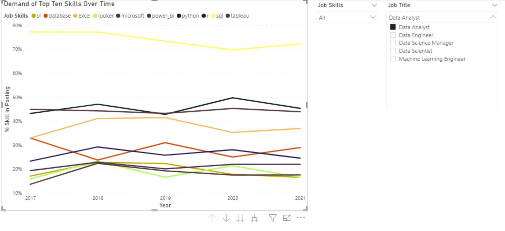

# Data-Science-Jobs-Analysis
Used Power BI to visualize and interpret fictional job data as part of DataCamp course 

## Overview

Using Power BI, data from fictional data science job postings were analyzed and visualized. This project was completed as a part of the DataCamp course titled, "Case Study: Analyzing Job Market Data in Power BI". 

## Results

